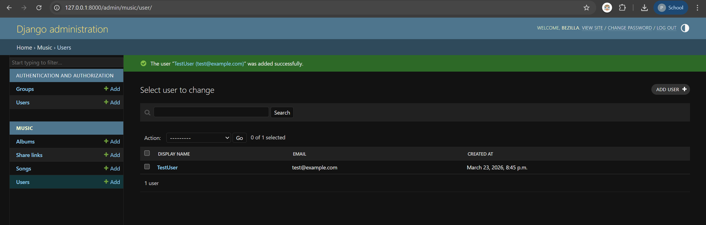
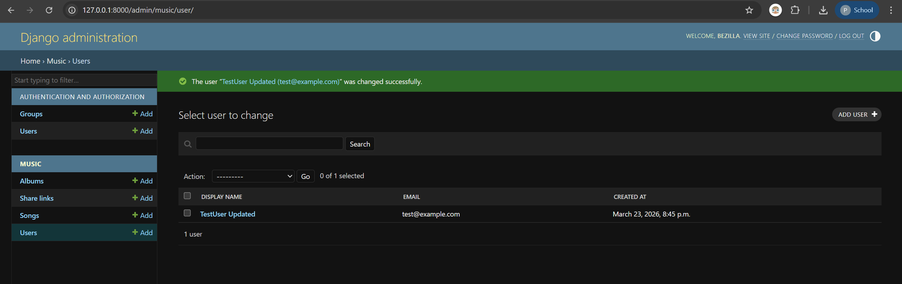
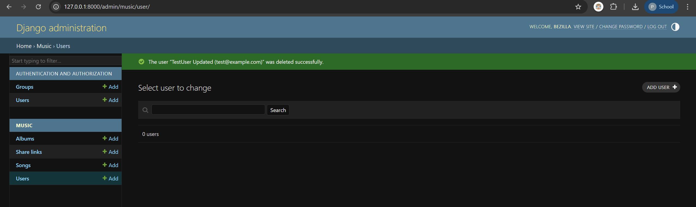

# Chithara AI Music Generator

Chithara is a web-based AI music generator that allows users to create original music tracks by specifying parameters such as title, occasion, description, and genre.

---

## Project Overview

Chithara lets users:
- Generate songs using AI based on input parameters
- Manage a personal song library
- Organize songs into albums
- Share songs and albums via links

---

## Tech Stack

- **Backend:** Django (Python)
- **Database:** SQLite (development)


## Installation


### Steps

**1. Clone the repository**
```bash
git clone https://github.com/Bezzilla/Chithara-AI-music-generator.git
cd Chithara-AI-music-generator
```

**2. Create and activate virtual environment**
```bash
python -m venv venv

# Windows
venv\Scripts\activate

# macOS/Linux
source venv/bin/activate
```

**3. Install dependencies**
```bash
pip install -r requirements.txt
```

**4. Set up environment variables**
```bash
# Windows
copy .env.example .env

# macOS/Linux
cp .env.example .env
```
Open `.env` and set a value for `SECRET_KEY`.

**5. Run migrations**
```bash
python manage.py migrate
```

**7. Create admin user**
```bash
python manage.py createsuperuser
```

**8. Start the server**
```bash
python manage.py runserver
```

**9. Open your browser at** `http://127.0.0.1:8000/admin`


---

## Project Structure
```
Chithara-AI-music-generator/
├── chithara/          # Django project settings
│   ├── settings.py
│   └── urls.py
├── music/             # Main domain app
│   ├── models.py      # Domain entities
│   ├── admin.py       # Admin CRUD interface
│   ├── views.py       # API views
│   ├── urls.py        # API routes
│   └── migrations/    # Database migrations
├── manage.py
├── requirements.txt
├── .env.example
└── README.md
```

---


## CRUD Evidence

### Create & Read


### Update


### Delete



## Deviations from Domain Model

### 1. User uses UUID instead of Google's ID
**Justification:** Google OAuth is out of scope for Exercise 3. UUID is used as a placeholder. When OAuth is implemented in a later exercise

### 2. duration on Song is nullable
**Justification:** The SRS (Section 9) lists song duration as an open issue. Since AI generation is also out of scope for this exercise, duration cannot be populated at creation time so it is kept nullable.

## API Endpoints

| Method | URL | Description |
|---|---|---|
| GET | `/api/users/` | List all users |
