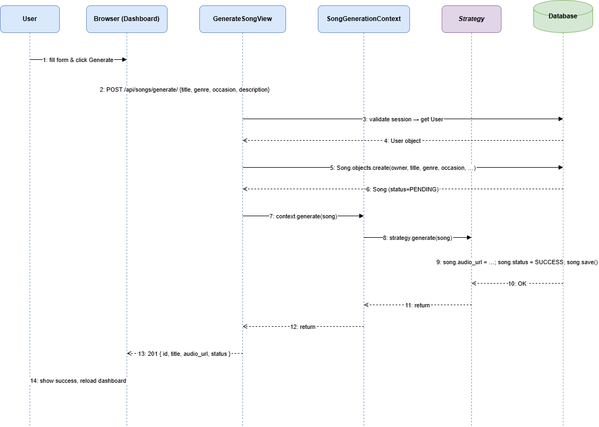
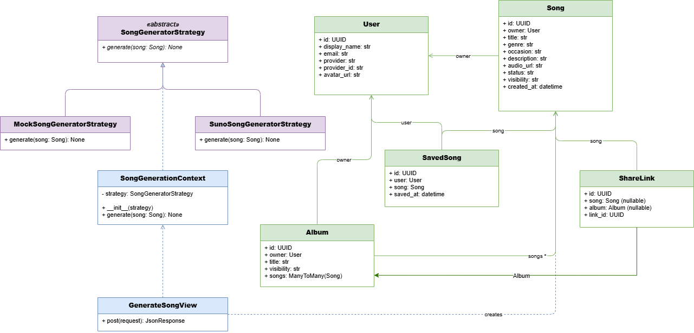
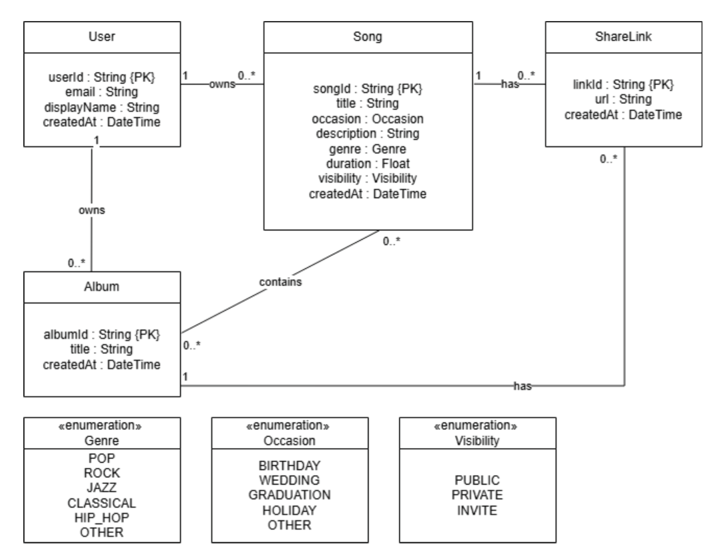

# Chithara AI Music Generator

Chithara is a web-based AI music generator that allows users to create original music tracks by specifying a title, occasion, genre, and description.

---

## Tech Stack

- **Backend:** Django 5.2 (Python)
- **Database:** SQLite (development)
- **AI Generation:** Suno API (via sunoapi.org)
- **Authentication:** Google OAuth 2.0 (via django-allauth)

---

## Installation

**1. Clone the repository**
```bash
git clone https://github.com/Bezzilla/Chithara-AI-music-generator.git
cd Chithara-AI-music-generator
```

**2. Create and activate a virtual environment**
```bash
python -m venv venv

# Windows
venv\Scripts\activate

# macOS/Linux
source venv/bin/activate
```

**3. Install dependencies**
```bash
pip install -r requirements.txt
```

**4. Set up environment variables**
```bash
# Windows
copy .env.example .env

# macOS/Linux
cp .env.example .env
```
Edit `.env` and fill in the values (see **Strategy Configuration** and **Google OAuth Setup** below).

**4a. Google OAuth Setup**

1. Go to [Google Cloud Console](https://console.cloud.google.com/)
2. Create a project → **APIs & Services** → **Credentials**
3. Click **Create Credentials** → **OAuth 2.0 Client ID**
4. Application type: **Web application**
5. Under **Authorized redirect URIs**, add:
   ```
   http://127.0.0.1:8000/accounts/google/login/callback/
   ```
6. Copy the **Client ID** and **Client Secret** into your `.env`:
   ```
   GOOGLE_CLIENT_ID=your-client-id-here
   GOOGLE_CLIENT_SECRET=your-client-secret-here
   ```

**5. Run migrations**
```bash
python manage.py migrate
```

**6. Create a superuser**
```bash
python manage.py createsuperuser
```

**7. Start the server**
```bash
python manage.py runserver
```

**8. Configure the site in admin**

Go to `http://127.0.0.1:8000/admin/` → **Sites** → change `example.com` to `127.0.0.1:8000`

**9. Open** `http://127.0.0.1:8000/` in your browser.

---

## Strategy Pattern 

Song generation uses the **Strategy design pattern**. The active strategy is selected via the `GENERATOR_STRATEGY` environment variable in `.env`.


### Mock mode (no API key required)

In `.env`:
```
GENERATOR_STRATEGY=mock
```

The mock strategy instantly marks the song as `SUCCESS` and returns a real hosted MP3. Useful for UI development and testing without spending API credits.

**Example response:**
```json
{
  "song_id": "3f1b2c4d-...",
  "title": "My Song",
  "status": "SUCCESS",
  "audio_url": "https://www.soundhelix.com/examples/mp3/SoundHelix-Song-1.mp3",
  "duration": 229.0
}
```

### Suno mode (real AI generation)

In `.env`:
```
GENERATOR_STRATEGY=suno
SUNO_API_KEY=your-suno-api-key-here
```

Get an API key from [sunoapi.org](https://sunoapi.org).

The API responds immediately with `PENDING` status while audio is generated in the background. Poll `GET /api/songs/<song_id>/` or refresh the page to check when status updates to `SUCCESS`.

**Example response:**
```json
{
  "song_id": "7a3c9e1f-...",
  "title": "My Song",
  "status": "PENDING",
  "audio_url": null,
  "duration": null
}
```


## System Design

### Sequence Diagram — Song Generation Flow




### Class Diagram




### Domain Diagram



